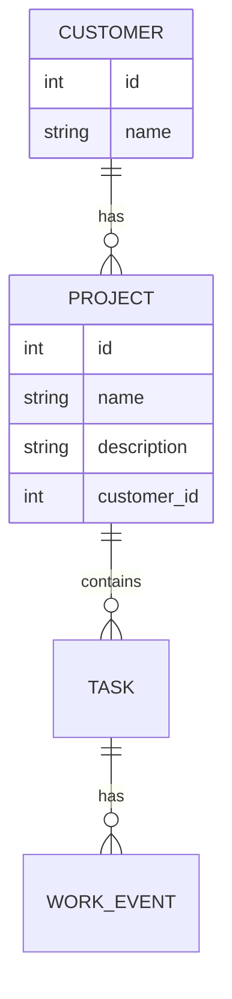

# go-what-did-i-do

[](https://github.com/joukojo/go-what-did-i-do/actions/workflows/build.yml)

Simple command line tool for handling project tasks

# Data relations 



# Data storage

The data is stored under user's home directory 

```bash
$HOME/.what-did-i-do  
```

| File    | Description |
| -------- | ------- |
| customers.json  |  customer-data in json-format    |
| projects.json  |  project-data in json-format    |

# Usage 

Help page is available for every command by: 

```bash 
what-did-i-do --help 
```

- [Customers](#customers)
- [Projects](#projects)

## Customers 

The customers command group allows you to manage your customer list. A customer can have multiple projects associated with them.
🔧 Usage

what-did-i-do customers [command] [flags]

### Available Commands

| subcommand for customers    | Description |
| -------- | ------- |
| [add](#add-a-customer)  | Adds a new customer to the system    |
| [delete](#delete-a-customer) | Deletes an existing customer by ID     |

### Flags

    -h, --help Show help for the customers command

### Examples 

#### Add a Customer

```bash
what-did-i-do customers add --name "Acme Corporation"
```

#### Delete a Customer

```bash
what-did-i-do customers delete --id 123445 
```

#### List Customers 

```bash
what-did-i-do customers 
```

## Projects 

This comamnd handles projects under the customer. One customer could have non or many projects. 

| Subcommand for projects   | Description |
| -------- | ------- |
| [add](#add-a-project-to-customer)  | Adds a new project for customer    |
| [delete](#delete-a-project) | Deletes an existing project by ID     |

### Add a project to customer

```bash
what-did-i-do projects add --customerId 12345 --name "Acme Corporation"
```

### Delete a project

```bash
what-did-i-do projects delete --id 12346
```

### List projects 

```bash
what-did-i-do projects 
```